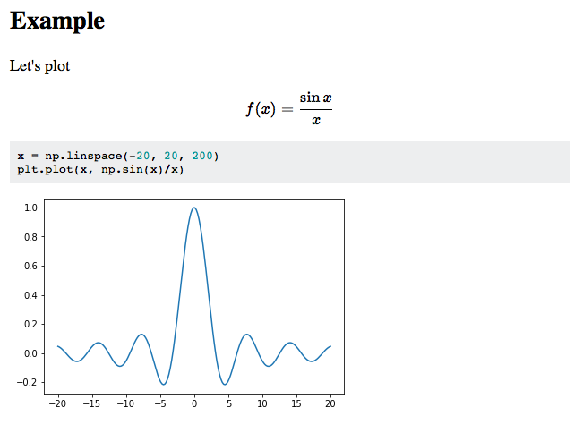

# KnitJ — Literate programming with Jupyter kernels

Inspired by [knitr](https://yihui.name/knitr/) and [R Markdown](http://rmarkdown.rstudio.com), KnitJ renders a mix of markdown and source code into HTML by evaluating the code in a Jupyter kernel.

In addition to a one-off conversion, KnitJ can serve the HTML document via HTTP and watch the source file for changes. When the source file is changed, KnitJ reevaluates only the changed bits (defined by boundaries between markdown and source code), and pushes the updates into the HTML document via WebSocket.

## Example

Either of the two following files renders into the same HTML document below with

```bash
knitj $SOURCE >$SOURCE.html
```

~~~markdown
```python
#::hide
import numpy as np
from matplotlib import pyplot as plt
%matplotlib inline
```

## Example

Let's plot

$$ f(x)=\frac{\sin x}x $$

```python
x = np.linspace(-20, 20, 200)
plt.plot(x, np.sin(x)/x)
```
~~~

```python
# ::hide
import numpy as np
from matplotlib import pyplot as plt
# ::%matplotlib inline

# ::>
# ## Example
#
# Let's plot
#
# $$ f(x)=\frac{\sin x}x $$

x = np.linspace(-20, 20, 200)
plt.plot(x, np.sin(x)/x)
```



Alternatively, one can start the KnitJ server, which starts watching the source file for changes and opens a browser window with the rendered and live-updated HTML document

```
$ knitj --server test.py
INFO:knitj:Started web server on port 8080
INFO:knitj.kernel:Starting kernel...
INFO:knitj.kernel:Kernel started
INFO:knitj:Started broadcasting to kernels
INFO:knitj.source:Started watching file test.py for changes
INFO:knitj.webserver:Browser connected: 4580648496
```

## Installing

Install with Pip from Github. Requires Python 3.6 or higher.

```
pip install git+https://github.com/azag0/knitj.git
```

The following dependencies are installed:

-   [Jupyter Client](https://github.com/jupyter/jupyter_client) for communicating with the Jupyter kernels
-   [Watchdog](https://pythonhosted.org/watchdog/) for watching a file for changes
-   [ansi2html](https://github.com/ralphbean/ansi2html) for converting ANSI color codes into HTML
-   [Misaka](http://misaka.61924.nl) for rendering Markdown
-   [aiohttp](http://aiohttp.readthedocs.io) for running a http and WebSocket server
-   [Pygments](http://pygments.org) for syntax highlighting
-   [Jinja](http://jinja.pocoo.org) for HTML templates
-   [Beautiful Soup](https://www.crummy.com/software/BeautifulSoup/) for parsing HTML

To use KnitJ, you also need some Jupyter kernel on your system. If you don’t have one, you can get the IPython kernel with

```
pip install ipykernel
```